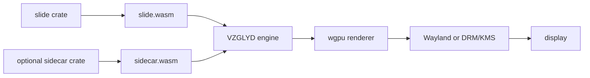

# VZGLYD


VZGLYD is a Raspberry Pi display engine for ambient 3D art and always-on
information. Slides are written in Rust, compiled to WebAssembly, and rendered
by a native Rust engine on a TV or monitor.

## Quick Start

Install on a Raspberry Pi 4 running DietPi with Weston in kiosk mode:

```bash
curl -fsSL https://raw.githubusercontent.com/vzglyd/vzglyd/main/install.sh | sudo bash
```

Run the default slide rotation:

```bash
vzglyd
```

Run a specific slide:

```bash
vzglyd --scene terrain
```

Build a slide from source:

```bash
cargo build -p terrain_slide --target wasm32-wasip1
```

Pack a slide directory into a `.vzglyd` archive:

```bash
vzglyd pack slides/terrain -o terrain.vzglyd
```

## Why VZGLYD Exists

VZGLYD is built on a simple idea: constraint is part of the medium. Each slide
lives inside a fixed form — Pi-class performance, a stable WebAssembly ABI, a
60,000-vertex budget, a small texture budget, and a bounded shader contract.
That is not "low poly" as nostalgia, and it is not photorealism on a budget. It
is a deliberate way to make small worlds where the rules are precise enough to
feel intentional and human-scaled.

The goal is a display that earns its place in a room. Not a browser dashboard
stretched across a television, and not an arms race of more geometry, more
materials, more effects. Just enough form, colour, motion, and data to make
something clear, ambient, and worth looking at. In a room you live in, the
slide should feel like a quiet companion — present in the periphery, never
demanding, yet alive in the way careful geometry, colour steps, and slow motion
keep nudging your eye toward it.

VZGLYD practices what the project calls the Constraint Principle: it is not
nostalgia for wireframes, but the conscious decision to operate with the same
formal discipline that once made every polygon matter. We know how to do
everything after Level Three, Level Four, Level Five—and we keep choosing Level
Six, where the constraint is the condition for visible choices, not a failure
mode. That makes the renderer feel modest by intention rather than by accident.
Read the full framing in `docs/constraint-principle.md`.

## What VZGLYD Is

- A native renderer built for constrained hardware instead of a fullscreen browser tab.
- A slide runtime with a stable WebAssembly ABI boundary.
- A system where bounded geometry, textures, and shaders are a deliberate form rather than a temporary limitation.
- A packaging model built around `.vzglyd` archives: `manifest.json`, `slide.wasm`, optional assets, optional sidecar.

## Slides

| Slide | Description | Needs config |
| --- | --- | --- |
| `clock` | Procedural analogue world clock. | No |
| `quotes` | Rotating quote slide with authored 3D backdrop. | No |
| `affirmations` | Text-first affirmation slide. | No |
| `did_you_know` | Fact slide backed by embedded datasets. | No |
| `budget` | Household budget slide backed by static YAML. | Yes |
| `chore` | Chore rotation slide backed by static YAML. | Yes |
| `weather` | Forecast slide with a sidecar fetching BOM data. | Yes |
| `air_quality` | Air quality slide with live sidecar data. | Yes |
| `afl` | AFL ladder and results slide. | Yes |
| `word_of_day` | Daily word slide with sidecar-backed data. | No |
| `on_this_day` | Historical events slide sourced from Wikipedia. | No |
| `calendar` | Calendar slide driven by ICS data. | Yes |
| `servers` | Server health and latency slide. | Yes |
| `news` | News feed slide aggregating RSS and related feeds. | Yes |
| `reminders` | Reminder slide fed by a sidecar bridge. | Yes |

## Building Your Own Slide

Start with the [authoring guide](docs/authoring-guide.md). It walks through the
ABI surface, packaging, shader contract, sidecars, local testing, and release
flow.

## Architecture



More detail lives in [docs/architecture.md](docs/architecture.md) and
[docs/shader-contract.md](docs/shader-contract.md).

## Development

```bash
cargo build
cargo test
cargo run -- --scene slides/clock
cargo run -- pack slides/clock -o /tmp/clock.vzglyd
```

If you are building slides, install the WASI target:

```bash
rustup target add wasm32-wasip1
```

## Contributing

Contribution guidelines live in [CONTRIBUTING.md](CONTRIBUTING.md). New slides
are especially welcome.

## License

Dual licensed under [MIT](LICENSE-MIT) or [Apache-2.0](LICENSE-APACHE).
